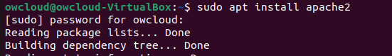
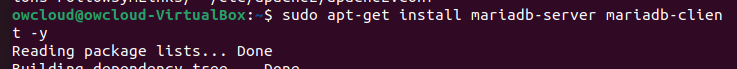
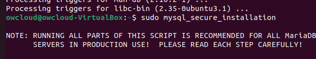
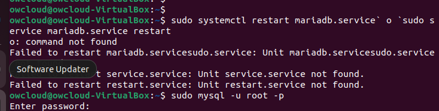
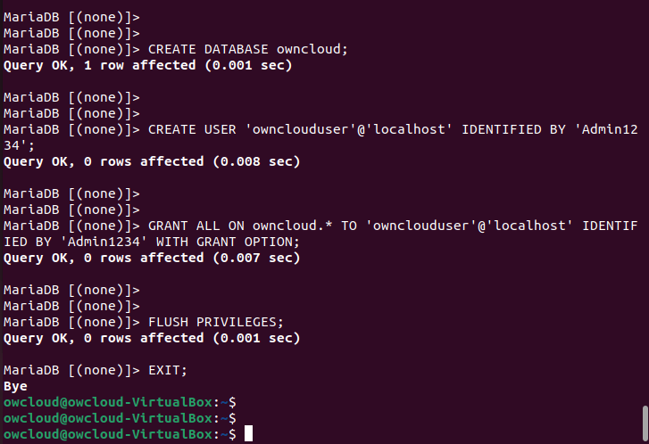
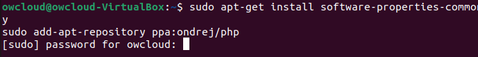
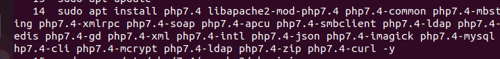

# Activitat 2                                                           Nil Horcas

## Pasos a seguir per fer l'instal·lació 

### 1- Apache
Primerament introduirem la primera comanda per instal·lar apache2 (sudo apt install apache2) i també (sudo sed -i "s/Options Indexes FollowSymLinks/Options FollowSymLinks/" /etc/apache2/apache2.conf) per desactiva els directoris del servidor.

### 2- Mariadb
Instalarem i configurarem Mariadb amb les seguents comandes: (sudo apt-get install mariadb-server mariadb-client -y) (sudo mysql_secure_installation) (sudo systemctl restart mariadb.service  o  sudo service mariadb.service restart) per reiniciar.

    

### 3- Base de dades
Entrarem a Mariadb per crear la base de dades on crearem l'usuari amb la contrasenya, dona-li accés a la base de dades. Amb les comandes (sudo mysql -u root -p) , (CREATE DATABASE owncloud;) , (CREATE USER 'ownclouduser'@'localhost' IDENTIFIED BY 'Admin1234';) , (GRANT ALL ON owncloud.* TO'ownclouduser'@'localhost' IDENTIFIED BY 'Admin1234' WITH GRANT OPTION;) 

    

### 4- PHP
Instalarem PHP amb els moduls necesaris i tenin en compte els requisits minims per owncloud. Despres instalarem i editarem el ficher php.ini per cambiar alguns factors en les comandes: (sudo apt-get install software-properties common -y) ,  (sudo add-apt-repository ppa:ondrej/php) , (sudo apt install php7.4 libapache2-mod-php7.4 php7.4-common php7.4-mbstring php7.4-xmlrpc php7.4-soap php7.4-apcu php7.4-smbclient php7.4-ldap php7.4-redis php7.4-gd php7.4-xml php7.4-intl php7.4-json php7.4-imagick php7.4-mysql php7.4-cli php7.4-mcrypt php7.4-ldap php7.4-zip php7.4-curl -y) , (sudo nano /etc/php/7.4/apache2/php.ini) 

             
 

### 5- Owncloud
Descargarem la ultima versió de Owncloud i mourem l'arxiu. Seguidament cambiaarem el propietari i els permisos dels directoris de Owncloud per que els puge utilitzar Apache2.

### 6- Configuració de Apache
